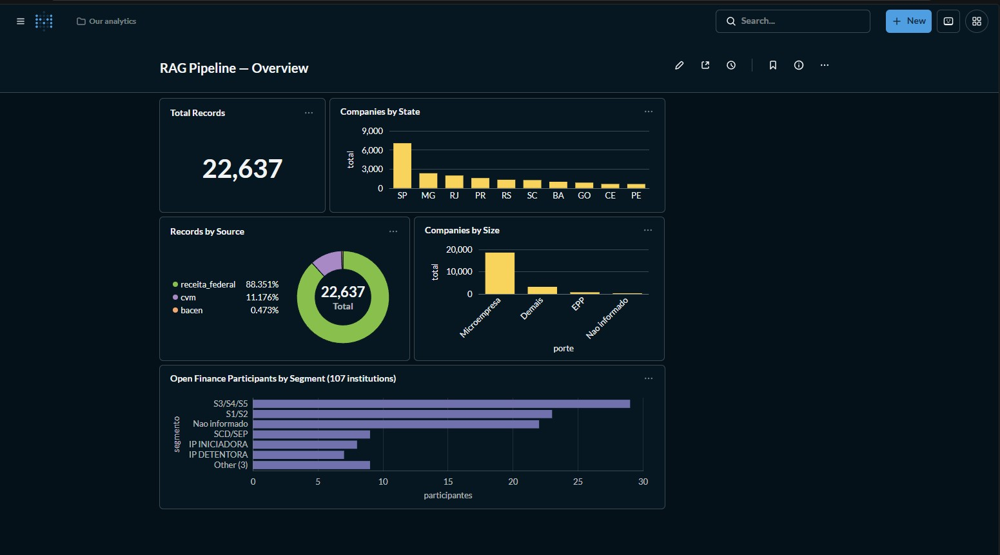

# RAG Financial Pipeline

> Production-grade Retrieval-Augmented Generation over Brazilian public financial data — built on the same architecture used to map **74M+ companies** across **30+ data sources**, serving **3,000+ active clients**.


[](https://github.com/devviniciusfmk-sys/rag-financial-pipeline/actions/workflows/ci.yml)


## What it does

Ingests data from **3 Brazilian government sources**, generates local embeddings, stores them in pgvector, and exposes a FastAPI that answers natural language questions about companies, banks, and financial institutions.

```
POST /ask → "Which banks participate in Open Finance?"
            "What is the largest fintech in São Paulo?"
            "Show companies with CNAE 6201 in Rio Grande do Sul"
```

## Architecture

```
┌─────────────────────────────────────────────────────────┐
│                      Data Sources                       │
│    Receita Federal  │  CVM  │  Bacen Open Finance       │
└────────────────────────┬────────────────────────────────┘
                         │  ingestion/downloader.py
                         │  (tqdm + tenacity retry + atomic .part)
                         ▼
              ingestion/cleaner.py
              (latin-1 CSV, CNPJ check digit, chunking)
                         │
                         ▼
              embeddings/generator.py
              (paraphrase-multilingual-MiniLM-L12-v2 · 384 dims · batches of 32)
                         │
                         ▼
              embeddings/store.py
              (pgvector · ivfflat cosine index · idempotent upsert)
                         │
                         ▼
              retrieval/search.py
              (hybrid: cosine + trigram on name/text + prefix bonus)
                         │
                         ▼
              pipeline/chain.py
              (OpenRouter · primary + fallback model · tenacity)
                         │
                         ▼
              api/main.py + routes.py
              (FastAPI · CORS · X-Process-Time · lifespan warm-up)
```

## Dashboard

Live analytics over 22,637 indexed records
from Receita Federal, CVM and Bacen Open Finance.



> Run locally: `docker compose up -d` → http://localhost:3001
> Card queries: [`docs/dashboard-queries.sql`](docs/dashboard-queries.sql)

## Data Sources

| Source | What it contains | Volume |
|---|---|---|
| Receita Federal — Empresas | 50M+ CNPJs, company name, size, share capital | ~10GB full |
| Receita Federal — Estabelecimentos | State (UF), CNAE and registration status | ~15GB full |
| CVM | Listed companies, balance sheets, income statements | ~2GB |
| Bacen Open Finance | Banks and fintechs in the Open Finance ecosystem | ~5MB |

## Quick Start

```bash
git clone https://github.com/devviniciusfmk-sys/rag-financial-pipeline
cd rag-financial-pipeline

python -m venv .venv && source .venv/bin/activate
pip install -r requirements.txt

cp .env.example .env
# Set OPENROUTER_API_KEY in .env

docker compose up -d
docker compose ps    # wait for "healthy"
```

## Build the index

```bash
# Demo mode — downloads slice 0 of each source (~1.5GB), indexes 20k companies
python -m scripts.build_index --limit 20000

# Full mode — all sources, millions of records
python -m scripts.build_index --limit 0
```

## Run the API

```bash
uvicorn api.main:app --reload --port 8000
# Docs at http://localhost:8000/docs
```

## Endpoints

| Method | Route | Description |
|---|---|---|
| `GET` | `/health` | DB, model and LLM status |
| `POST` | `/ask` | Natural language question over company data |
| `GET` | `/search?q=nubank&limit=5` | Semantic search by company name or description |
| `GET` | `/companies?uf=RS&porte=01` | Filter companies by state, size, CNAE |
| `GET` | `/stats` | Total records by source, last ingestion time |

```bash
curl -s localhost:8000/stats

curl -s "localhost:8000/search?q=nubank&limit=5"

curl -s localhost:8000/ask \
  -H "Content-Type: application/json" \
  -d '{"question": "Which banks participate in Open Finance?"}'
```

## Multi-model LLM Routing

The pipeline uses OpenRouter with automatic fallback:

```
Primary model (nvidia/nemotron-3-ultra-550b-a55b:free)
        ↓ rate limit / timeout / unavailable
Fallback model (google/gemma-4-31b-it:free)
        ↓ both fail
RuntimeError with full context preserved
```

Response includes `model_used` and `fallback_used` fields for observability.

## Test Suite

```bash
pip install -r requirements-dev.txt
pytest                          # 115 tests
pytest tests/test_cleaner.py -v
```

| File | Tests | Covers |
|---|---|---|
| `test_cleaner.py` | 56 | CNPJ check digit, capital parsing, chunking, Estabelecimentos join, round-trip |
| `test_embeddings.py` | 16 | Shape (n,384), float32, normalized, batch processing |
| `test_api.py` | 20 | All endpoints, CORS, 422/500/502/503 error handling |
| `test_chain.py` | 14 | Fallback, no-context guard, invalid key, all-fail |
| `test_downloader.py` | 12 | RFB share discovery, URL building, zip/JSON validation, zip-slip |

No database, network or API key required to run tests.

## Database Schema

Table `company_embeddings`:

| Column | Type | Notes |
|---|---|---|
| `id` | BIGSERIAL PK | |
| `cnpj` | VARCHAR(14) | normalized, no punctuation |
| `text_chunk` | TEXT | human-readable company description |
| `embedding` | vector(384) | paraphrase-multilingual-MiniLM-L12-v2 |
| `metadata` | JSONB | source, uf, cnae, porte, situacao |
| `created_at` | TIMESTAMPTZ | |

Indexes: `ivfflat (embedding vector_cosine_ops)`, GIN on `metadata`, unique on `(cnpj, md5(text_chunk))` — making ingestion fully idempotent.

## Key Engineering Decisions

**Why local embeddings?** `paraphrase-multilingual-MiniLM-L12-v2` runs on CPU, costs $0, and produces 384-dim vectors. The English-only `all-MiniLM-L6-v2` was tried first and scored 0.34 on a query as direct as "Nu Pagamentos" — Portuguese needs a multilingual model.

**Why hybrid search?** Vector search alone missed exact company names ("Itau Unibanco" returned nothing). Three lexical signals are added to the cosine score: `word_similarity` on the company name, `word_similarity` on the chunk text (catches literal terms like "Open Finance" that live in the text but not in the name), and a prefix bonus. `word_similarity` rather than `similarity`: the latter compares whole strings, scoring "Nu Pagamentos" against "Nu Pagamentos S.A. - Instituicao De Pagamento" at 0.412 — tied with the unrelated "Pagamentos Limitados Ltda" (0.407). Every component is returned per hit.

**Why separate embed text from display text?** Every chunk shares the same template, and that boilerplate dominated the vector: short queries landed far from every document. The embedded text carries only the discriminating content ("Nu Pagamentos S.A. - instituicao de pagamento, Open Finance, segmento S1/S2"), while the readable template is what the API returns.

**Why pgvector over FAISS?** Persistent storage, SQL filters and idempotent upserts.

**Why OpenRouter?** Single API key, 100+ models, automatic failover between providers. The pipeline stays model-agnostic.

**Why idempotent upsert?** Re-running the ingestion never creates duplicates. The `md5(text_chunk)` unique constraint makes the index rebuild-safe.

## Author

**Vinicius Fernandes** — AI / Data Engineer

Built on production experience mapping 74M+ companies across 30+ data sources at scale.

[LinkedIn](https://www.linkedin.com/in/viniciusfernandes-1b3a79361) · [GitHub](https://github.com/devviniciusfmk-sys)
